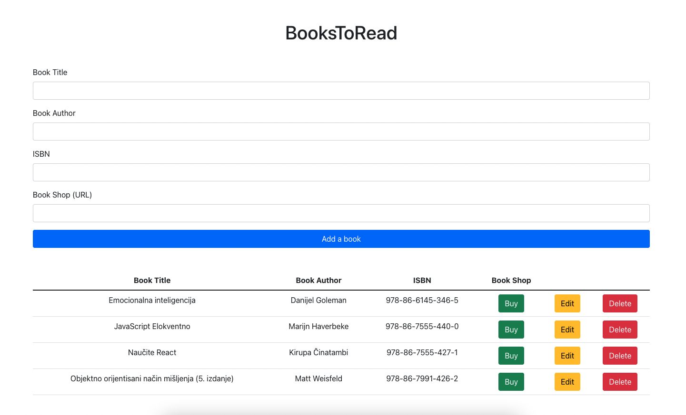

**BooksToRead** is a web application for storing a list of books you want to read.

You can input a book title, book author, isbn, book shop url and you can add a book into a list of books you want to read.

All informations about books is stored in a database.

After you add a book in a list of books you want to read, you can go to buy a book by click on button buy, or you can edit all information about book and save changes or delete book from a list of books you want to read.

This web app is build with ReactJS on frontend and Node.js, Express, PostgreSQL on backend.

